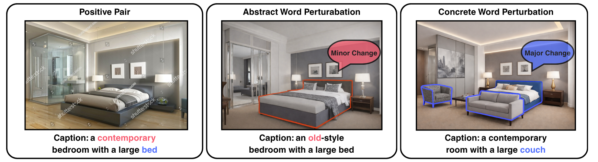

This preprint explores a simple but important question in vision-language
learning: what kinds of negative examples actually teach models to understand
composition rather than memorize shallow correlations?

<figure>
  
  <figcaption>
    ConcretePlant and Slipform generate concreteness-aware hard negatives to improve compositional learning in vision-language models.
  </figcaption>
</figure>

We focus on a persistent weakness in many vision-language models: they often
struggle when meaning depends on the precise arrangement of words or the
binding between attributes and objects. Rather than redesigning the whole
architecture, this work studies the data side of the problem and asks how to
construct better contrastive signals during training.

Our central idea is that lexical concreteness matters. Swapping or modifying
highly concrete concepts tends to create sharper semantic and visual
differences, which makes negative examples more informative for learning. On
top of that, we introduce a margin-based objective, Cement loss, to keep easy
examples from dominating optimization and crowding out harder compositional
cases.

Together, these ideas form Slipform, which improves compositional benchmarks
while also helping on retrieval and probing tasks. If you'd like to read the
paper, you can find the arXiv preprint [here](https://arxiv.org/abs/2604.13313).
